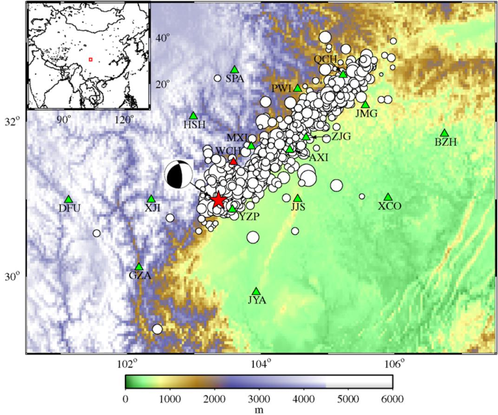
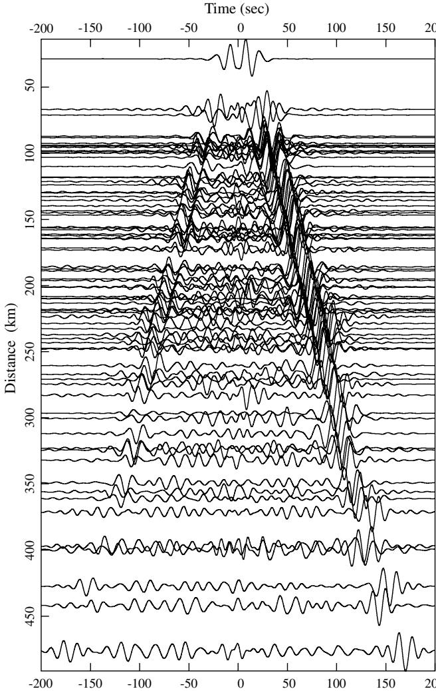
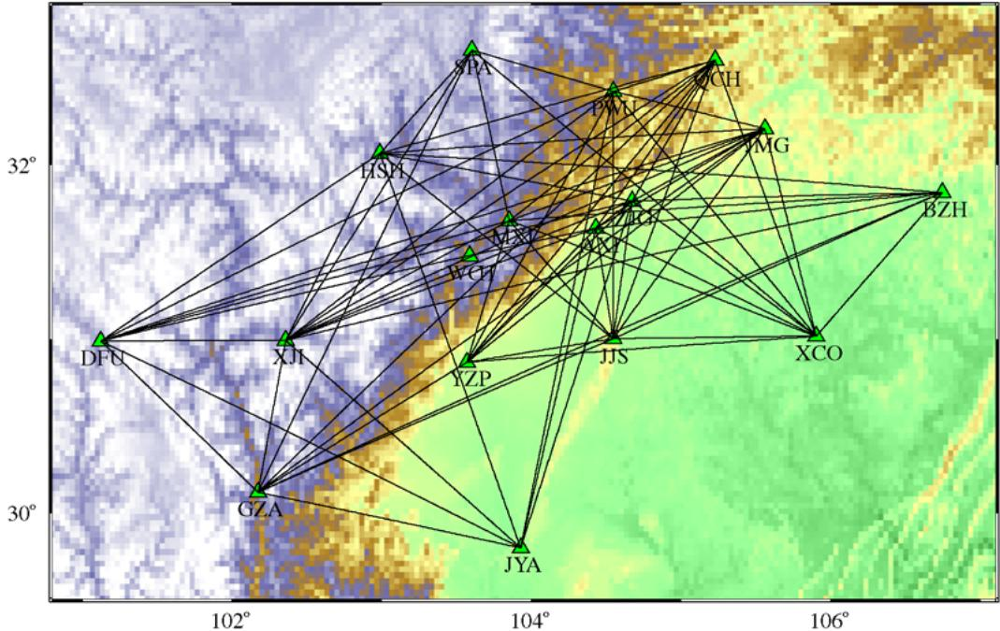
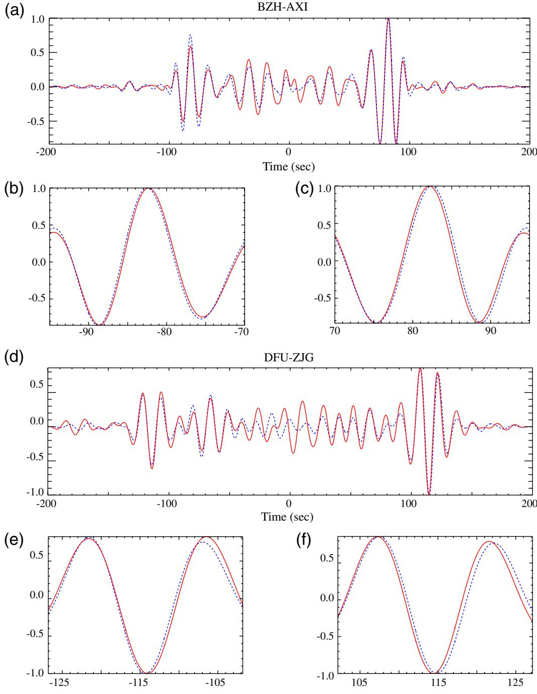
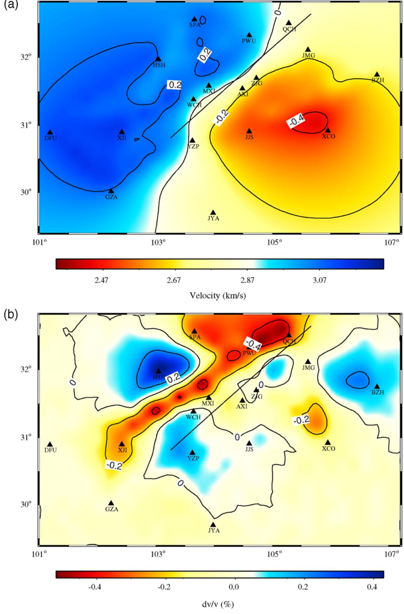
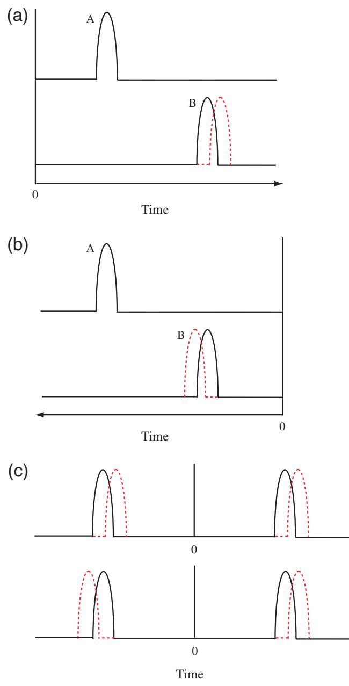
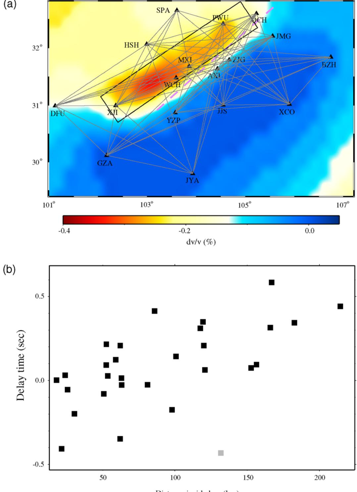
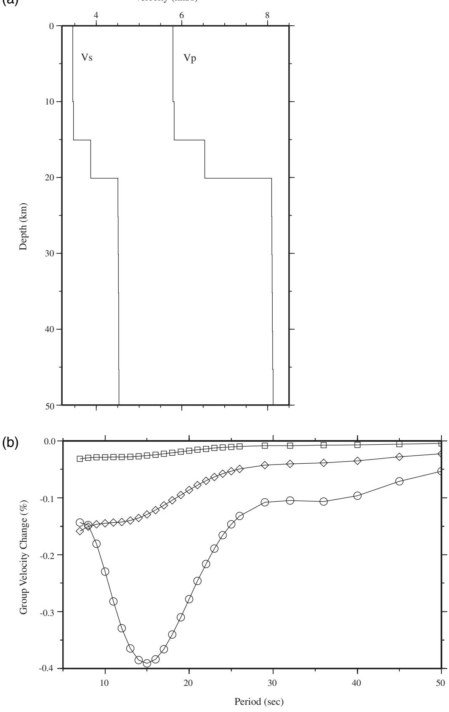

# Coseismic Velocity Change in the Rupture Zone of the 2008 $M _ { \mathrm { w } }$ 7.9 Wenchuan Earthquake Observed from Ambient Seismic Noise

by Xin Cheng, Fenglin Niu, and Baoshan Wang\*

Abstract We investigated seismic velocity and structural changes along the Longmen Shan fault associated with the $2 0 0 8 M _ { \mathrm { w } } 7 . 9$ Wenchuan earthquake using ambient seismic noise data recorded by the regional seismic network of the China Earthquake Administration. We computed cross correlograms of continuous records of station pairs from which we obtained clear Rayleigh-wave signals at periods of 10 to $2 5 \mathrm { \ s } .$ . We measured the travel speeds of these Rayleigh waves from ambient noise data recorded before and after the earthquake and obtained a total of 77 estimates of group velocity along paths running across the rupture zone of the earthquake. Most of the ray paths showed increasing travel times of Rayleigh waves right after the earthquake. We inverted the measured differential travel times along different ray paths to constrain regions with significant changes in seismic velocity. Our 2D tomographic image showed a distinct region with an ${ \sim } 0 . 4 \%$ velocity decrease. The strike and extension of this region match remarkably well with the deep rupture area of the earthquake. Because the Rayleigh waves that we used in this study travel as deep as ${ \sim } 2 5 \ \mathrm { k m }$ below the surface, it is difficult to explain the observed velocity changes solely with shallow damages $( < 1 0 0 \mathrm { ~ m } )$ resulting from strong shaking. Numerous laboratory studies have shown that the speed at which seismic waves travel through rocks changes with the level of stress. The velocity decrease observed here thus may be caused by a large stress drop associated with the earthquake. Assuming a stress drop of $3 \ \mathrm { M P a }$ , we obtained a stress sensitivity of $1 . 3 \times 1 0 ^ { - 9 } \ \mathrm { P a } ^ { - 1 }$ , consistent with both laboratory and field observations. Our results suggest that time-lapse seismic imaging with ambient noise data provides a promising probe for monitoring temporal structural changes at seismogenic depths.

# Introduction

Earthquakes occur when a fault fails, either because of the buildup of stress or due to the weakening of the fault. Measuring and monitoring changes in stress level and fault strength are thus of great importance to pinpoint faults that are close to failing. Because seismic waves penetrate to great depths, time-lapse seismic imaging (4D) provides a promising way to measure changes deep in the crust where earthquakes occur that may be more difficult to observe by conventional surface instruments. General approaches of monitoring temporal changes include measuring changes in the travel time of direct $P$ and $S$ waves, and detecting changes in the coda waves (e.g., coda wave interferometry). To look for such changes, usually a highly repeatable source, either natural or artificial, is required to minimize artifacts arising from changes in source location and mechanism.

Repeating earthquakes and controlled sources are the two most used sources so far in 4D seismic studies.

By comparing travel times of direct and coda waves from repeating seismic events occurring before and after large earthquakes, a number of studies (Schaff and Beroza, 2004; Rubinstein and Beroza, 2004a, 2004b, 2005; Peng and Ben-Zion, 2006; Rubinstein, Uchida, and Beroza, 2007) found significant coseismic velocity drops near the rupture areas of the large earthquakes. Most of the velocity decreases appeared to occur within the fault zone at very shallow depths $( < 1 0 0 \mathrm { ~ m } )$ due to the direct damages caused by strong motions of the large earthquakes. On the other hand, Niu et al. (2003) observed robust changes in the scattered wavefield associated with the 1993 Parkfield aseismic transient event. The changes were interpreted as resulting from deep fluid migration induced by subsurface stress changes.

Repeating earthquakes are ideal sources to illuminate stress transients at seismogenic depth; however, given their depth and large size, it is difficult to use them to monitor the transients because of the uncontrollable timing of the earthquakes and uncertainty in source location. In some aspects, controlled sources are the most promising probes because of superior time resolution and repeatability. For example, with data recorded from repeated chemical explosions, Li and coworkers (Li et al., 1998; Vidale and Li, 2003; Li et al., 2006) were able to resolve an ${ \sim } 2 0 0 ~ \mathrm { m }$ coseismic fault damage zone and the postseismic healing processes of several large earthquakes along the San Andreas fault. Using a piezoelectric source, Niu et al. (2008) found the travel times along a fixed pathway located at $1 ~ \mathrm { k m }$ below the surface in the SAFOD (San Andreas Fault Observatory at Depth) drill site followed closely with barometric pressure changes observed at the surface. More importantly, they observed two velocity changes associated with two local earthquakes. Both velocity changes had a preseismic component that was interpreted as prerupture stress-induced changes in crack properties, similar to early laboratory observations (Brace et al., 1966; Scholz, 1968).

While controlled sources are probably the best way for seismic monitoring, the high operating costs make it hard to run them routinely. Recent development of a new seismic imaging technique with ambient noise provides a new probe for seismic monitoring. It has been recently shown that the cross-correlation function of a pair of recordings of a diffuse wave field, such as the coda wave or ambient noise data, can be used to retrieve the Green’s function between two receivers, as if one of the receivers behaves like an impulsive source (Weaver and Lobkis, 2001). Campillo and Paul (2003) and Shapiro and Campillo (2004) showed that coherent surface wave pulses could indeed be extracted from coda waves of large earthquakes and ambient seismic noise data, respectively. Since then, surface wave tomography based on the ambient seismic noise data has emerged as a powerful method for producing high-resolution images of the crust and upper mantle at regional and local scales (Shapiro et al., 2005; Yao et al., 2006; Yang et al., 2007).

For stations with long recording history, the ambient seismic noise imaging technique also provides a way for investigating subsurface structural changes. Sens-Schönfelder and Wegler (2006) investigated the variations of the seismic velocity field beneath the Merapi volcano in Indonesia with ambient seismic noise data. They found a seasonal variation in the subsurface velocity field that is best explained by precipitation data. On the other hand, Brenguier, Shapiro, et al. (2008) applied the same technique to ambient seismic noise data recorded around the Piton de la Fournaise volcano on La Reunion Island, and found decreases of seismic velocity on the order of $0 . 0 5 \%$ a few weeks before eruptions. They further suggested that the observed decreases in seismic velocity is likely to be caused by magmatic motions and can be used to monitor volcanic activity. Brenguier, Campillo, et al. (2008) also investigated ambient seismic noise data in the Parkfield section of the San Andreas fault and found coseismic velocity reductions and postseismic healings associated with the 2003 San Simeon and 2004 Parkfield earthquakes. The observed $0 . 1 \%$ coseismic velocity drops are lower in comparison to what Li and coworkers observed (Li et al., 1998; Vidale and Li, 2003; Li et al., 2006); this is probably due to the large amount of temporal stacking and spatial averaging employed in the study in order to obtain robust Green’s functions. Because high-frequency coda waves are used here, it is unclear whether the observed coseismic velocity drops are caused by near surface damages or induced by stress changes at depth.

On 12 May 2008 a devastating magnitude 7.9 earthquake struck central China at the east edge of the Tibet plateau (see Fig. 1). The earthquake is named after its epicenter, which is located at Wenchuan County in Sichuan province, about $8 0 ~ \mathrm { k m }$ west-northwest of Chengdu, the capital of the province. The rupture plane, Longmen Shan fault, is a remarkable sharp boundary seen in the topographic map of the region. To its northwest is the Tibetan plateau, the highest plateau in the world, which was produced by the collision of the northward movement of the India plate relative to the Eurasia plate. To the southeast of Longmen Shan fault is the Sichuan basin, where the eastward deformation of the Tibetan plateau caused by the collision was stopped by its rheologically strong lithosphere. The elevation of the high rise of the Tibetan plateau descends rapidly from as high as $6 0 0 0 \mathrm { ~ m ~ }$ to $5 0 0 \mathrm { ~ m ~ }$ over a very short distance of ${ \sim } 5 0 ~ \mathrm { k m }$ across the Longmen Shan fault. A steep gradient of crustal thickness, from ${ \sim } 6 0 \ \mathrm { k m }$ in the west to ${ \sim } 4 0 \ \mathrm { k m }$ in the east, was also observed across the region (Yao et al., 2006). GPS measurements reveal a very low convergence rate $( < 3 ~ \mathrm { m m / y r } )$ across the Longmen Shan fault region. On the other hand, the eastern Tibetan plateau is moving eastward at a much higher rate of $1 5 { - } 2 0 ~ \mathrm { m m / y r }$ , resulting in a significant buildup of deformation and stress along the Longmen Shan fault.

The Wenchuan earthquake ruptured over a length of ${ \sim } 3 0 0 ~ \mathrm { k m }$ along the northeastern-striking Longmen Shan thrust belt. The global CMT solution (Dziewonski et al., 1981) showed a fault rupture plane with a strike azimuth of $2 3 1 ^ { \circ }$ and a dip of $3 5 ^ { \circ }$ . The rupture consisted of both thrusting and rightlateral strike slipping motions (Ji, 2008; Nishimura and Yagi, 2008). Coseismic slip was estimated to be up to $1 0 \mathrm { m }$ , with a significant portion of the rupture occurring at depths between ${ \sim } 5 $ to $2 5 \mathrm { k m }$ (Ji, 2008). As the upgraded regional seismic network of the China Earthquake Administration has a fairly good coverage of the rupture area and has been operating continuously before the earthquake, it is thus an ideal area to test the feasibility of using continuous ambient noise data to monitor subsurface structural and stress changes.

# Data and Methods

# Green’s Function Extraction

We collected a total of ${ \sim } 1 0 0$ days ${ \sim } 5 0$ days before and after the 2008 Wenchuan earthquake) of continuous waveform data recorded by the regional broadband seismic network operated by the China Earthquake Administration. We first cut the continuous seismic records to daily-based segments and then decimated them from 100 samples per second to 20 samples per second. Because all of the stations were equipped with the same instrumentation, a Guralp CMG-3ESP sensor and a GangZhen EDAS-24IP data acquisition system, we computed the cross correlograms using the raw velocity records without removing the instrument responses. We used a running time window method in calculating the daily cross-correlation functions. We employed an 8192-point (409.6 s) long time window and a 1024-point step in the calculation, resulting in 1679 normalized crosscorrelation functions for one pair of daily records. If there was a gap in one of the two seismograms within the running window, the cross-correlation function was not computed for this window. Within each running time window, we first removed any linear trends and the means from each of the seismograms. We further applied spectral whitening to the two seismograms. This was done by setting the amplitudes in the frequency band between 0.02 to $1 . 0 \ \mathrm { H z }$ to 1 and 0 elsewhere while keeping the phases unchanged. The purpose of spectral whitening was to enhance the ambient noise signals. The cross-correlation functions were then computed in frequency domain. Finally, the cross-correlation functions computed from the running time windows were linearly stacked. We further filtered the stacked daily cross-correlation functions with a second order band-pass Butterworth filter in the frequency band of 0.04 to $0 . 1 \mathrm { H z }$ . At this frequency band, the sampling depth range of Rayleigh waves was around $1 0 { - } 2 5 \mathrm { k m }$ where large coseismic slips were observed.

  
Geographic location of the $2 0 0 8 \ M \ 7 . 9$ Wenchuan earthquake and map of the study area. The epicenter of the Wenchuan Figure 1.earthquake is marked with a star. Also shown is the moment tensor solution of the main shock. Aftershocks $( M > 3$ ) that occurred within one and a half months after the main shock are marked with circles and superimposed on the topography map. The size of the circle is scaled to the size of the earthquake. Triangles are the 16 broadband stations used in this study (station WCH was damaged during the earthquake and was not used in this study). Notice that the aftershocks are well confined along the boundary between the Tibet plateau at the northwest and the Sichuan basin at the southeast. The color version of this figure is available only in the electronic edition.

The cross-correlation function of ambient seismic noise computed from a pair of stations contains surface waves traveling in the opposite directions along the great circle path between the two stations. If the sources of noise are uniformly distributed around the two stations, the crosscorrelation function is expected to be symmetric. However, most of the daily cross-correlation functions appeared to be asymmetric, indicating that noise sources are not evenly distributed. While the uneven distributions of the ocean coasts could be the most likely cause, we speculate the large topographic relief in the study region also plays a role in the asymmetry. Ground motions induced by strong winds associated with the topographic relief could be one source of the seismic noises. While most of the daily cross-correlation functions clearly showed the two Rayleigh-wave pulses, we further stacked them to get better signal-to-noise ratio (SNR). We also excluded some daily cross-correlation functions with low SNR. To do this, we first stacked all the daily cross correlograms to generate a reference trace. We then computed the cross-correlation coefficient between the individual daily cross-correlation functions with the reference trace. Traces with a cross-correlation coefficient less than 0.8 were removed from the stacking. Cheng et al. (2007) showed that the uncertainty in measuring arrival time of a signal depends solely on the SNR. To keep the uncertainty below $0 . 1 \ s$ , we found that we needed to stack at least one month of the ambient noise data. To detect possible coseismic seismic velocity changes, we generated two stacks using ${ \sim } 1 0 0$ days’ records straddling the earthquake, roughly 50 days before and 50 days after the event. We noticed that several stations close to the fault were down for a few days to one week right after the earthquake. WCH station is located near the epicenter and was down for a long period after the earthquake, so we could not obtain any postseismic stacking from this station. We obtained a total of 77 pairs of Green’s functions (Fig. 2) from 16 stations that sample the rupture area and its surroundings before and after the earthquake (Fig. 3). Note that in Figure 2, only a portion of the stacked crosscorrelation functions (preseismic stack) were shown for display purpose. The correlograms were also rearranged to ensure that the large Rayleigh-wave packet appears in the casual side (positive time side).

  
Example of 10–25 s Rayleigh wave obtained from Figure 2.ambient seismic noise cross-correlation sorted by interstation distance. Moveout with increasing station-to-station distance can be clearly observed.

# Delay Time Measurements

In general, the pre- and postseismic Green’s functions computed from each station pair are very similar to each other (Figs. 4a,d). Yet there are slight differences in the travel time of the Rayleigh waves (Figs. 4b,c,e,f). We measured these travel-time differences with a cross-correlation method. A 25 s time window was used in computing the cross correlation. As shown in Cheng et al. (2007), it is possible to obtain subsample time precision where a cross-correlation based method is used to measure the differential time between two highly similar wavelets. Uncertainties in the differential time measurements depend solely on SNR of the Rayleigh waves. The calculated Green’s functions have a sampling rate of 20 samples per second; we used a cosinefitting scheme to get the final delay time measurements. We measured the delay times of the postseismic Rayleigh waves using both the causal and acausal Green’s function signals. In general, the two measurements yield the same amount of delay times but with opposite signs. In the next section, we will discuss how to use the two delay times measured from the causal and acausal signals to diagnose their possible causes. Although there are a total of 120 possible station pairs, we finally obtained 77 delay time measurements that were used in the final time-lapse inversion.

# Time-Lapse Tomographic Inversion

As shown in Figure 3, the 77 ray paths provided excellent coverage of the rupture area of the Wenchuan earthquake. To determine regions with significant coseismic velocity changes, we inverted the delay time measurements with a 2D tomography method. We divided the study area $\mathrm { 1 0 1 . 0 ^ { \circ } - 1 0 7 . 2 ^ { \circ } ~ E }$ , $2 9 . 4 ^ { \circ } - 3 2 . 8 ^ { \circ } \mathrm { ~ N } )$ into $0 . 2 ^ { \circ } \times 0 . 2 ^ { \circ }$ blocks and used the surface wave tomography method developed by Ditmar and Yanovskaya (1987) to determine group velocities of each block. We conducted two separate inversions to obtain group velocities of each block before and after the earthquake. The absolute travel times of Rayleigh waves were taken as the arrival times when the Green’s function reaches its maximum amplitude. We measured the absolute travel times with the causal $( T _ { \mathrm { m a x } } ^ { + } )$ and acausal $( T _ { \mathrm { m a x } } ^ { - } )$ signals in the preseismic Green’s functions and only used those pairs with $T _ { \mathrm { s u m } } = T _ { \mathrm { m a x } } ^ { + } + T _ { \mathrm { m a x } } ^ { - } \approx 0$ in the inversion. The postseismic travel times were obtained by adding the delay times to the preseismic travel times. We used them to conduct the second inversion to obtain the group-velocity map after the earthquake. By taking the difference between the two groupvelocity maps, we obtained an image that contrasts coseismic velocity changes.

  
Ray path coverage of the data used to obtain the measurements of velocity variations. The color version of this figure is Figure 3.available only in the electronic edition.

# Results and Discussion

The group-velocity map inverted from the preseismic Rayleigh-wave travel-time data is shown in Figure 5a. There is a good correlation between the seismic velocity structure and geological terrains. The Sichuan basin is featured with a pronounced low-velocity structure, probably due to the sediment layer inside the basin, while the upper crust of the Tibet plateau has a relatively high seismic velocity. The Longmen Shan fault (the straight line shown in Fig. 5a) marks the sharp boundary between the two terrains. The velocity map here is in good agreement with previous studies (e.g., Yao et al., 2006).

The time-lapse image revealed significant coseismic velocity changes in the study area (Fig. 5b). The most distinct change occurred in an elongated area located in the northwest side of the Longmen Shan fault. Inside this area, seismic wave velocities drop as much as $0 . 4 \%$ . The area extends as much as ${ \sim } 2 5 0 ~ \mathrm { k m }$ in the northeast-southwest direction with a width of ${ \sim } 5 0 ~ \mathrm { k m }$ . It roughly follows the surface trace of the Longmen Shan fault. There are three areas around stations HSH, BZH, and YZP that showed an increased velocity. While they may reflect real velocity changes in these areas, two of them (HSH and BZH) are located near the edges of the map, which usually have large uncertainties in the inversion.

As mentioned previously, we paid special attention in picking the delay times related to structural changes in the crust. As discussed in Stehly et al. (2007), clock errors can also introduce apparent changes in the arrival times of both the causal and acausal signals. As the clocks of all the stations were regularly synchronized by GPS, the longterm drifting of clocks at different stations was expected to be very minor. As discussed in Stehly et al. (2007), we used the two delay times measured from the causal and acausal signals to determine whether these delays were caused by subsurface structural changes or by unsynchronized clock errors. As schematically shown in Figure 6, if there was a slow clock in one of the stations, say station B, and if we used station A as a reference to compute the cross-correlation function, the casual signal would arrive later in comparison with the acausal signal (Figs. 6a,b). Similarly, if there was clock drift in the two study periods, then we expected the measured delay time would be asymmetric, that is, an increase in the travel time of causal signal and a decrease of travel time of the acausal signal (Fig. 6c) and vice versa. On the other hand, a decrease of subsurface velocity resulted in an increase of travel times of both the causal and the acausal signals (Fig. 6c). Based on this diagnosis, we chose only 77 cross-correlation functions whose causal and acausal signals were both strong and showed the same amount of travel time in our inversions.

To test the robustness of the observed velocity drop, we first conducted a resolution test. We assigned a $0 . 5 \%$ velocity drop to a rectangular area that outlines the region with significant velocity decrease shown in Figure 5b. We computed the travel-time anomalies along the 77 ray paths caused by the velocity drop. We then inverted the synthetic travel-time data back to the velocity domain. As shown in Figure 7a, the input rectangular area can be well resolved by the observed data coverage, while the input amplitude of the velocity drop is slightly under-recovered. Besides the previously mentioned resolution test, we also found the observed delay times could be roughly explained by their travel times within the rectangular area. For each of the 77 ray paths, we calculated the length of the ray segment inside the rectangul shown in Figure 7a. We then plotted the observed delay times as a function of the calculated ray segment length (Fig. 7b) and found a positive correlation between the two. A general concern in time-lapse seismic imaging is mapping source variations into structural changes. Here we argue this is not the case for several reasons. First, the observed velocity drop is coincident, in space and time, with the occurrence of the earthquake. If there is a systematic change in source signature, such a change should be observed across all the ray paths, instead of being seen at the pairs only traveling through the rupture area. In principle, the amplitude spectrum of the Green’s function could change with source distribution, while the phase spectrum should be insensitive to noise sources. Because they originated from different sources, the causal and acausal arrivals were expected to have different changes if these changes were caused by temporal variations in source signature. We also found that the dominant frequency band of our Green’s functions was ${ \sim } 5 { \mathrm { - } } 2 5 \ \mathrm { s }$ . There is no significant change in frequency during the 100-day period. We thus believe that the observed velocity drop is a true feature that reflects the subsurface structural changes induced by the Wenchuan earthquake.

  
Examples of time shift in observed Green’s function before and after the occurrence of the 2008 Wenchuan earthquake. Figure 4.Continuous and dashed traces corresponding to the measurements obtained before and after the Wenchuan earthquake, respectively. (b) and (c) are enlarged target time windows for (a). (e) and (f) are enlarged target time windows for (d). Symmetric delays of postseismic arrivals are clearly shown in the enlarged time windows. The color version of this figure is available only in the electronic edition.

  
(a) Group-velocity map from 10 to $2 5 ~ \mathrm { s }$ Rayleigh-wave measurements. (b) Map shows coseismic velocity changes obtained Figure 5.from the measured delay times. The straight line indicates the surface trace of the Longmen Shan fault. The color version of this figure is available only in the electronic edition.

  
Diagrams show different effects on the arrival and Figure 6.delay times caused by a clock error and a change in the subsurface velocity field. (a) and (b) show a slow clock at station B could result in an apparent shift (either forward or backward) in the arrival time of surface waves with respect to station A. Continuous and dashed traces correspond to recordings with a normal and a slow clock, respectively. (c) shows the effects caused by a clock error (top) and a medium-velocity drop on the cross-correlation function computed between station A and B. The color version of this figure is available only in the electronic edition.

Possible explanations for temporal changes of medium velocity associated with large earthquakes include strongmotion-induced damage at very shallow depths, usually around hundreds of meters (Schaff and Beroza, 2004; Rubinstein, Uchida, and Beroza, 2007) and stress-induced change at seismogenic depth, as well as those related to the healing processes afterward (Li et al., 1998; Vidale and Li, 2003). Besides earthquakes, water level variations associated with precipitations can also cause changes in seismic velocity at very shallow depths. Among the regions of velocity changes associated with shallow structural damages, the region with largest velocity drop usually occurs within the narrow fault damage zones. As the region with significant velocity changes lies at the northwest sides of the surface exposure of the Longmen Shan fault and the sampling depth of the Rayleigh waves used in this study, it is unlikely to attribute the velocity drop solely to these surficial processes.

To further illustrate the deep origin of the observed velocity drop, we generated two types of 1D velocity models with a velocity reduction occurring at the top $1 \mathrm { k m }$ (shallow) and $2 5 \ \mathrm { k m }$ (deep), respectively (Fig. 8). Group-velocity changes calculated from these models are shown in Figure 8b. A $0 . 2 \%$ decrease in $P -$ - and $s$ -wave velocity, if confined within the top $1 ~ \mathrm { k m }$ , results in an almost negligible change $( < 0 . 0 5 \% )$ in group velocity (open squares in Fig. 8b). The same amount of velocity change, if extended to $2 5 \mathrm { k m }$ , could generate roughly the observed amount of group-velocity drop (open circles). Shallow models with larger velocity decrease (open diamonds corresponding to a $1 \%$ velocity drop) also cannot duplicate the observed data, suggesting part of the observed velocity drop must have a deep origin.

Nishimura and Yagi (2008) and Ji (2008) reported that the Wenchuan earthquake ruptured along a plane that dips ${ \sim } 3 3 ^ { \circ }$ to the west. Considering the sampling depths of the Rayleigh waves used in this study were around 10 to $2 5 \mathrm { k m }$ , the observed region with large velocity drop agrees remarkably well with the projection of the Longmen Shan fault in these depths. Thus, the most likely cause for the observed velocity drop is the coseismic stress drop along the fault and its surrounding regions, as proposed by Nishimura et al. (2000). The reduced stress level results in an increase of fracture density that reduces the travel speed of seismic waves, as observed by many laboratory studies (e.g., Birch, 1960, 1961; Scholz, 1968; Nur and Simmons, 1969). If we assume a coseismic stress drop of $3 \ \mathrm { M P a }$ , we obtain a stress sensitivity of $1 . 3 \times 1 0 ^ { - 9 } \ \mathrm { P a ^ { - 1 } }$ , which lies at the lower end of the laboratory and field observations (e.g., Birch, 1960, 1961; De Fazio et al., 1973; Leary et al., 1979; Yamamura et al., 2003; Silver et al., 2007). As crack density inside crust rocks decreases with depth, the low value of stress sensitivity may reflect the depth feature of our observation. We also noticed that the postseismic measurements are 50-day averages after the earthquake. Significant healing may have occurred within the fault damage zone, so the coseismic velocity drop might be larger than what we observed here. As mentioned in the Introduction, one of the drawbacks in using natural sources in time-lapse seismic imaging is their low temporal resolution. Nevertheless, our study here, combined with previous ones, suggests that time-lapse seismic imaging with ambient noise data provides a promising probe for monitoring the temporal structural changes at seismogenic depth.

  
(a) Synthetic test showing the recovered velocity changes with the same ray path coverage as the data. The input model has a Figure 7.reduced velocity of $0 . 5 \%$ inside the rectangular area that was constructed from the observed velocity drop shown in Figure 5b. Also shown are the stations and ray paths used in the test. The dashed line indicates the surface trace of the Longmen Shan fault. (b) Delay times are plotted against lengths of the ray segments within the rectangular area shown in (a). Note the positive correlation between the two. Gray square represents the measurement from station pair JYA-HSH, which appears to be an outlier. The color version of this figure is available only in the electronic edition.

  
Synthetic test showing the dependence of the 10–25 s Rayleigh-wave group-velocity changes on a 1D layered structural Figure 8.velocity changes. (a) shows the 1D layered velocity model used in the synthetic test. (b) the open squares show the Rayleigh-wave group-velocity decrease due to a $0 . 2 \%$ velocity decrease of the $P .$ - and $S \cdot$ -wave velocities confined within the top $1 ~ \mathrm { k m }$ , while the open circles show the responses to the same amount of $P .$ - and $S$ -wave velocities changes for the top $2 5 ~ \mathrm { k m }$ . The open diamonds correspond to a $1 \%$ velocity drop within top $1 ~ \mathrm { k m }$ .

# Conclusions

We used continuous seismic records of ambient noise data to map seismic velocity changes along the Longmen Shan fault and its surrounding areas associated with the 2008 Wenchuan earthquake. We were able to obtain good Rayleigh-wave signals at the intermediate period band of 10–25 s with moderate stacking of the cross correlograms of regional ambient noise records. We found a $0 . 4 \%$ velocity drop in an elongated area in the northwest side of the fault that is best explained by stress-induced changes at seismogenic depths. Our study indicates a new usage of regional seismic networks that are mainly designed for monitoring local seismicity. They are also useful in time-lapse seismic imaging, providing a new valuable tool to monitor changes in the subsurface stress field and crustal structure, especially at seismogenic depths.

# Data and Resources

Waveform data for this study were provided by the Data Management Center of the China National Seismic Network at Institute of Geophysics, China Earthquake Administration.

# Acknowledgments

We are especially grateful to Paul Silver, who passed away tragically in an automobile accident recently, for his encouragement and discussion in conducting this study. Critical comments from two anonymous reviewers significantly improved the quality of this paper. This work was supported by NSF grant EAR-0748455.

# References

Birch, F. (1960). The velocity of compressional waves in rocks to 10 kilobars, part 1, J. Geophys. Res.  1083–1102.   
Birch, F. (1961). The velocity of compressional waves in rocks to 10 kilobars, part 2, J. Geophys. Res.  2199–2224.   
66,Brace, W. F., B. W. Paulding, and C. H. Scholz (1966). Dilatancy in the fracture of crystalline rocks, J. Geophys. Res.  3939–3953.   
71,Brenguier, F., N. M. Shapiro, M. Campillo, V. Ferrazzini, Z. Duputel, O. Coutant, and A. Nercessian (2008). Towards forecasting volcanic eruptions using seismic noise, Nat. Geosci.  126–130, doi 10.1038/ ngeo104.   
Brenguier, F., M. Campillo, C. Hadziioannou, N. M. Shapiro, R. M. Nadeau, and E. Larose (2008). Postseismic relaxation along the San Andreas Fault at Parkfield from continuous seismological observations, Science 1478–1481.   
321,Campillo, M., and A. Paul (2003). Long-range correlations in the diffuse seismic coda, Science 547–549.   
Cheng, X., F. Niu, P. G. Silver, S. Horiuchi, K. Takai, Y. Iio, and H. Ito (2007). Similar microearthquakes observed in western Nagano, Japan, and implications for rupture mechanics, J. Geophys. Res.  B04306, doi 10.1029/2006JB004416.   
De Fazio, T. L., K. Aki, and J. Alba (1973). Solid earth tide and observed change in the in situ seismic velocity, J. Geophys. Res. 1319–1322.   
Ditmar, P. G., and T. B. Yanovskaya (1987). Generalization of the Backus-Gilbert method for estimation of the horizontal variations of surface wave velocity, Physics of the Solid Earth 470–477.   
Dziewonski, A. M., T.-A. Chou, and J. H. Woodhouse (1981). Determination of earthquake source parameters from waveform data for studies of global and regional seismicity, J. Geophys. Res. 2825–2852.   
Ji, C. (2008). Preliminary result of the May 12, 2008 $M _ { \mathrm { w } }$ 7.9 eastern Sichuan, China earthquake: http://www.geol.ucsb.edu/faculty/ji/big_ earthquakes/2008/05/12/ShiChuan.html.   
Leary, P. C., P. E. Malin, R. A. Phinny, T. Brocher, and R. Voncolln (1979). Systematic monitoring of millisecond traveltime variations near Palmdale, California, J. Geophys. Res.  659–666.   
84,Li, Y.-G., P. Chen, E. S. Cochran, J. E. Vidale, and T. Burdette (2006). Seismic evidence for rock damage and healing on the San Andreas Fault associated with the 2004 M 6 Parkfield earthquake, Bull. Seismol. Soc. Am.  349–363.   
96,Li, Y.-G., J. E. Vidale, K. Aki, F. Xu, and T. Burdette (1998). Evidence of shallow fault zone healing after the 1992 M 7.5 Landers, California, earthquake, Science  217–219.   
279,Nishimura, N., and Y. Yagi (2008). http://www.geol.tsukuba.ac.jp/ \~nisimura/20080512/.   
Nishimura, T., N. Uchida, H. Sato, M. Ohtake, S. Tanaka, and H. Hamaguchi (2000). Temporal Changes of the Crustal Structure Associated with the $M 6 . 1$ Earthquake on September 3, 1998, and the Volcanic Activity of Mount Iwate, Japan, Geophys. Res. Lett.  269–272.   
27,Niu, F., P. G. Silver, R. M. Nadeau, and T. V. McEvilly (2003). Stress-Induced Migration of Seismic Scatterers Associated with the 1993 Parkfield aseismic transient event, Nature  544–548.   
426,Niu, F., P. G. Silver, T. M. Daley, X. Cheng, and E. L. Majer (2008). Preseismic velocity changes observed from active source monitoring at the Parkfield SAFOD drill site, Nature  204–208, doi 10.1038/ nature07111.   
Nur, A., and G. Simmons (1969). The effect of saturation on velocity in low porosity rocks, Earth Planet. Sci. Lett.  183–193.   
7,Peng, Z., and Y. Ben-Zion (2006). Temporal changes of shallow seismic velocity around the Karadere-Duzce branch of the north Anatolian fault and strong ground motion, Pure Appl. Geophys.  567–599, doi 10.1007/s00024-005-0034-6.   
Rubinstein, J. L., and G. C. Beroza (2004a). Evidence for widespread nonlinear strong ground motion in the $M _ { \mathrm { w } }$ 6.9 Loma Prieta earthquake, Bull. Seismol. Soc. Am.  1595–1608.   
94,Rubinstein, J. L., and G. C. Beroza (2004b). Nonlinear strong ground motion in the ML 5.4 Chittenden earthquake: Evidence that preexisting damage increases susceptibility to further damage, Geophys. Res. Lett. L23614, doi 10.1029/2004GL021357.   
31,Rubinstein, J. L., and G. C. Beroza (2005). Depth constraints on nonlinear strong ground motion from the 2004 Parkfield earthquake, Geophys. Res. Lett.  L14313, doi 10.1029/2005GL023189.   
32,Rubinstein, J. L., N. Uchida, and G. C. Beroza (2007). Seismic velocity reductions caused by the 2003 Tokachi-Oki earthquake, J. Geophys. Res.  B05315, doi 10.1029/2006JB004440.   
Schaff, D. P., and G. C. Beroza (2004). Coseismic and postseismic velocity changes measured by repeating earthquakes, J. Geophys. Res. B10302, doi 10.1029/2004JB003011.   
Scholz, C. H. (1968). Microfracturing and the inelastic deformation of rock in compression, J. Geophys. Res.  1,417–1,432.   
73,Sens-Schönfelder, C., and U. Wegler (2006). Passive image interferometry and seasonal variations of seismic velocities at Merapi volcano, Indonesia, Geophys. Res. Lett.  L21302.   
33,Shapiro, N. M., and M. Campillo (2004). Emergence of broadband Rayleigh waves from correlations of the ambient seismic noise, Geophys. Res. Lett.  L07614, doi 10.1029/2004GL019491.   
31,Shapiro, N. M., M. Campillo, L. Stehly, and M. H. Ritzwoller (2005). High resolution surface wave tomography from ambient seismic noise, Science  1615–1618.   
Silver, P. G., T. M. Daley, F. Niu, and E. L. Majer (2007). Active source monitoring of crosswell seismic traveltime for stress-induced changes, Bull. Seismol. Soc. Am. 281–293.   
97,Stehly, L., M. Campillo, and N. M. Shapiro (2007). Travel time measurements from noise correlation: Stability and detection of instrumental errors, Geophys. J. Int.  223–230.   
Vidale, J. E., and Y. G. Li (2003). Damage to the shallow Landers fault from the nearby Hector Mine earthquake, Nature  524–526.   
421,Weaver, R. L., and O. I. Lobkis (2001). Ultrasonics without a source: thermal fluctuation correlations at MHz frequencies, Phys. Rev. Lett. 134301–134304.   
Yamamura, K., O. Sano, H. Utada, Y. Takei, S. Nakao, and Y. Fukao (2003). Long-term observation of in situ seismic velocity and attenuation, J. Geophys. Res.  doi 10.1029/2002JB002005.   
Yang, Y., M. H. Ritzwoller, A. L. Levshin, and N. M. Shapiro (2007). Ambient noise Rayleigh wave tomography across Europe, Geophys. J. Int.  259–274.   
168,Yao, H., R. D. van der Hilst, and M. V. De Hoop (2006). Surface-wave array tomography in SE Tibet from ambient seismic noise and two station analysis: I–Phase velocity maps, Geophys. J. Int.  732–744.   
Department of Earth Science   
Rice University   
6100 Main Street   
Houston, Texas 77005